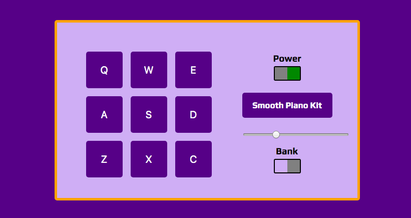

# React Drum Machine
This project is to fulfill freeCodeCamp Front End Libraries certification Project 3: https://learn.freecodecamp.org/front-end-libraries/front-end-libraries-projects/build-a-drum-machine

[](screenshot)

## Library used

- React

## How to run: 
```
npm install 
npm start
```
